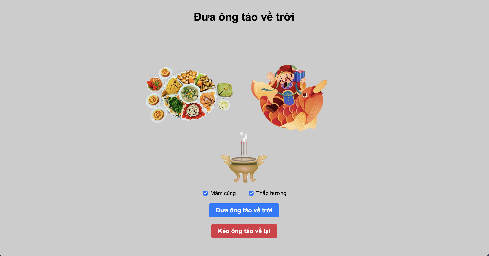

# Đưa ông táo về trời


## Description

This code represents the phrase "Đưa ông táo về trời" which translates to "Sending the Kitchen God to Heaven" in English.
It is a traditional Vietnamese practice where people bid farewell to the Kitchen God on the 23rd day of the twelfth lunar month.
The phrase is often used in cultural celebrations and rituals.

## Table of Contents

- [Installation](#installation)
- [Usage](#usage)
- [Contributing](#contributing)
- [License](#license)

## Installation

To install this project, run the following command:

```
git clone https://github.com/hoangduy0610/ong-tao-ve-troi.git
```

## Usage

To use this project, run it with any web server.

## Contributing

Contributions are welcome! If you would like to contribute to this project, please follow these guidelines:

1. Fork the repository.
2. Create a new branch.
3. Make your changes.
4. Commit your changes.
5. Push to the branch.
6. Submit a pull request.

## License

This project is licensed under the [MIT License](LICENSE).

